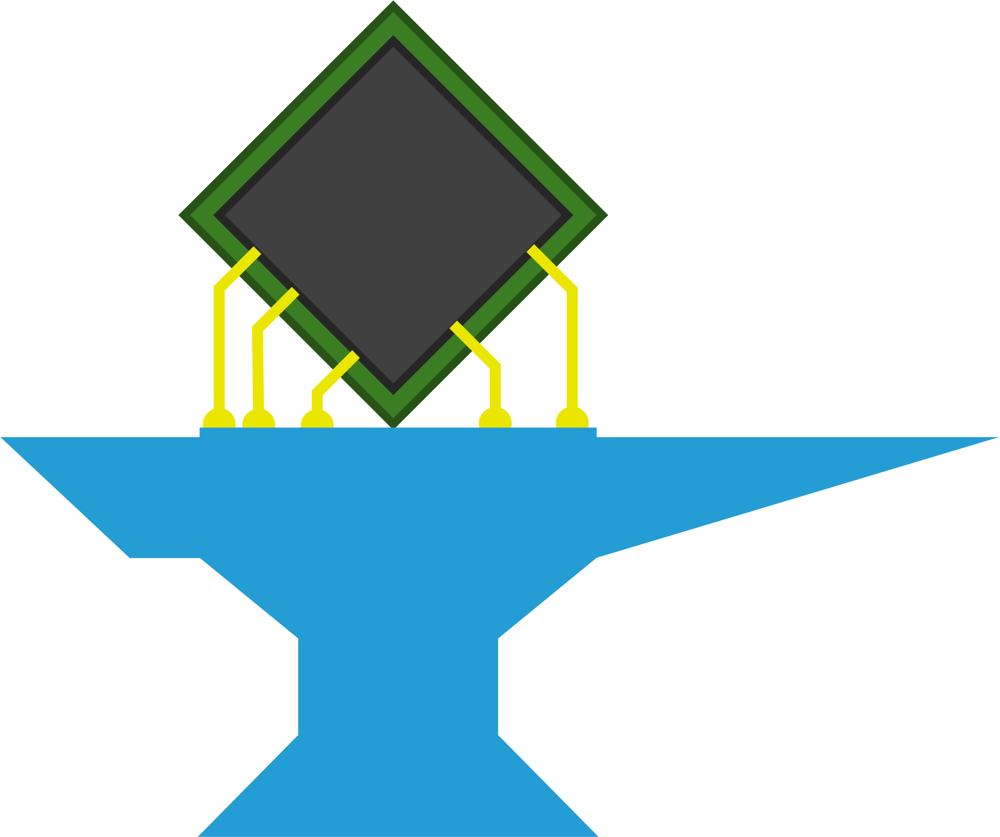

<div align="center">


<h3 align="center"><em>Model, design, and explore tensor algebra accelerators.</em></h3>



<br>
<br>

[](https://pypi.org/project/accelforge/)
[](https://www.python.org/)
[](https://opensource.org/licenses/MIT)
[](https://accelergy-project.github.io/accelforge/)

[](https://github.com/Accelergy-Project/accelforge/actions)
[](https://github.com/psf/black)
[](https://github.com/Accelergy-Project/accelforge/pulls)

</div>

---

AccelForge is a framework for modeling, designing, and exploring tensor algebra accelerators. It uses [HWComponents](https://github.com/accelergy-project/hwcomponents) as a backend for area, energy, latency, and leak power estimates.

Learn more at the [website](https://accelergy-project.github.io/accelforge/) or on [GitHub](https://github.com/Accelergy-Project/accelforge).

## ⚡ Features

- **Flexible Full-Stack Modeling** of a wide variety of devices, circuits, architectures, workloads, and mappings. We integrate with [HWComponents](https://github.com/accelergy-project/hwcomponents), with easily-modifiable models for component area, energy, latency, and leak power.
- **Fast and optimal mapping** of workloads onto architectures, yielding the best-possible performance and energy efficiency.
- **Fusion-aware mapping** that optimizes fusion for cascades of Einsums, enabling end-to-end optimization of entire workloads.
- **Heterogenous Architectures** that can include multiple types of compute units.
- **Strong input validation** via Pydantic, with clear error reports for invalid specifications.
- **Pythonic Interfaces** that enable easy automation and integration with other tools.

## 📦 Install

```bash
pip install accelforge
```

## 🧪 Examples

See [`examples/`](examples) for architectures and workloads, and [`notebooks/`](notebooks) for tutorials.

## 📚 Cite

If you use AccelForge in your work, please see [Citing AccelForge](https://accelergy-project.github.io/accelforge/guide/citation.html) for the relevant papers.
